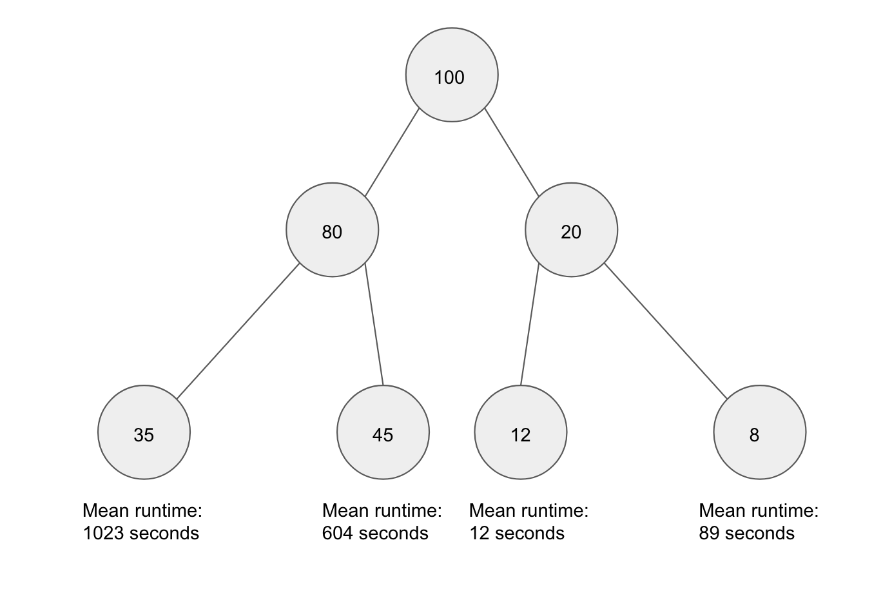
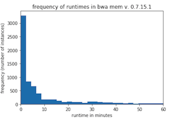
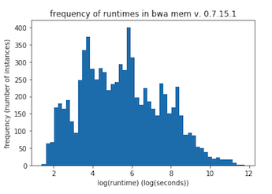
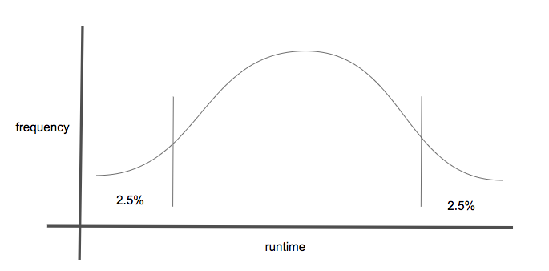
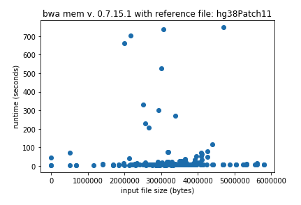

# The Analysis of Data Collected by the Galaxy Project

## Abstract
The public server of the Galaxy Project ( http://usegalaxy.org ) has been collecting extensive job run data on all analyses since 2013. This large collection of jobs run instances (with their corresponding attributes) can be leveraged to determine more efficient ways for allocation of Galaxy server resources. In addition, these data represent the largest, most comprehensive dataset available to date on the runtime dynamics for some of the most popular biological data analysis software. In this work we were aiming at creating a model for runtime prediction of complex algorithms trained on real data. In this paper we will:

1. Present statistical summaries of the dataset, describe its structure, identify the presence of
undetected errors, and discuss any other insights into the Galaxy server that we believe will be
useful to the community.
2. Confirm that the random forest regressor gives the best performance for predicting the runtime
of complex algorithms as was seen by Hutter et al.
3. Discuss the benefits and drawbacks of using a quantile random forest for creating runtime
prediction confidence intervals.
4. Present an alternative approach for choosing a walltime for complex algorithms with the use of
a random forest classifier.

Studying the Galaxy Project dataset reveals that there may be room to fine tune the resource allocation.
The ability to determine appropriate walltimes will save server resources from jobs that result in errors
undetected by the server — such as jobs that fall into infinite loops. Once freed, these resources can then be used to run jobs in the queue without the need to allocate additional hardware.

## Table of Contents
[to be fixed at the end]
* [what is the galaxy project](#background:-what-is-the-galaxy-project)
* scikit-learn and machine learning
* previous work
* description of data collected
* Possible schemes for outlier detection
* feature selection
* random forests
* classification results
* future work

### Background: What is the Galaxy Project

The Galaxy Project is a platform that allows researchers to run popular bioinformatics analyses quickly and easily. In the past, trying to run a popular analysis would require downloading, configuring, and troubleshooting the analysys software on one's own machines. This can be a difficult and time consuming task.

With the Galaxy Project, researchers run analyses on the public Galaxy server. To do so, the user needs only to connect to www.usegalaxy.org, upload their data, choose the analysis and the analysis parameters (if any), and hit run. The output can be viewed once it is finished.

For more information visit www.galaxyproject.org.

### Background: scikit-learn and machine learning

scikit-learn is a library of machine learning tools for Python. It has classes for anything machine learning related - from data prepocessing to regression and classification to model evaluation. The sci-kit learn library is the main library we used in our tests - specifically the regression and classification classes.

In this paper our main tool for regression and classification was the random forest, so we will briefly go over what a random forest is.

A random forest is a collection of decision trees, and a desion tree is a series of questions asked about an object. At the end of the questions, a previously unkown attribute of the object is guessed. An example of a decision tree is shown below.

In this case, the decision tree tries predict how long a job is going to take. The decision tree learns what questions to ask by training on a training set of previous jobs. At each node, it looks at a subset of attributes and chooses to split the data in the way that most minimizes variability in the subsequent two nodes. In this way, it sorts objects by similarity of the dependent and independent variables.

A random forest is a collection of decision trees, each of which are trained with a unique random seed. The random seed determines which sub-sample of the data each decision tree is trained and which sub-sample of attributes each tree uses. By implementing these constraints, the random forest protects itself from overfitting - a problem to which decision trees are susceptible.

Incidently, the decision tree also offers a way to see which independent attributes have the greatest effect on the dependent attribute. The more often a decision tree uses an attibute to split a node, the larger it's implied effect on the dependent attribute. The scikit-learn Random Forest classes have an easy way of getting this information with the feature_importances_ class attribute.

### Background: Previous work on runtime prediction of programs

[

this part in brackets are just my notes

also this section needs to be heavily edited at the end

PQR: Predicting Query Execution Times for Autonomous Workload Management (2008) [Gupta et al.](http://doi.org/10.1109/ICAC.2008.12) -> PQR trees are like decision trees, but the categories are chosen dynamically and each node has a different classifier.

On the use of machine learning to predict the time and resources consumed by applications (2010) [Matsunaga et al.](http://doi.org/10.1109/CCGRID.2010.98) -> BLAST (local alignment algorithm) and RAXML PQR2

Algorithm Runtime Prediction: Methods & Evaluation (2014) -> [Hutter et al.](https://doi.org/10.1016/j.artint.2013.10.003)

]

Previous work on runtime prediction of complex algorithms have seen a wide range of approaches.

In 2008, [Gupta](http://doi.org/10.1109/ICAC.2008.12) proposes a tool called a PQR (Predicting Query Runtime) Tree to classify the runtime of queries that users place on a server. In the same paper, Gupta presents a way to dynamically choose runtime bins that would be appropriate for a set of historical query runtimes. [an explanation of how they do this] The paper notes that the PQR Tree outperforms the decision tree, and that the performance of both trees imporoves with the use of dynamically chosen bins over the use of a-priori chosen bins. However, the results were not compared to the performance of a Random Forest.

In 2010, [Matsunaga](http://doi.org/10.1109/CCGRID.2010.98) enhances on the PQR Tree by adding linear regressors at its leaves, naming it PQR2. They test their model against two bioinformatic analyses tools: BLAST (a local alignment algorithm) and RAxML (a phylogenetic tree constructer). They used mean performance error (MPE) as a metric for their results. The improvements found are shown in the table below.

#### MPE of PQR vs PQR2

|TOOL|PQR|PQR2|
|---|---|---|
|BLAST|8.81%|8.76%|
|RAxML|40.82%|35.30%|

Recently, [Hutter](https://doi.org/10.1016/j.artint.2013.10.003) compared multiple methods of predicting the runtime of a number of complex algorithms. They compared 11 regressors including ridge regression, neural networks, Gaussian process regression, and random forests. They did not include PQR tree in their evaluations. They find that the random forest outperforms the other regressors in nearly all assessments and is able to handle high dimensional data without the need of feature selection.

This is the first time that such a large dataset has been available to attempt to create a runtime prediction model trained on real data. We verify that Random Forests are the best model for the regression, and present a practical approach for determining an appropriate walltime, which is with the use of a classifier.

## Overview of Data

All of the tools found on usegalaxy.org are tracked. The data is collected using the Galactic Radio Telescope (GRT), which records a comprehensive set of job run attributes.

This includes:

* create time
* runtime
* user selected parameters (tool specific)
* state ("ok", "error", or other)
* input data
  - size of input data
  - filetype of input data (.fastq, .fastq.gz, ...)
* hardware info
  - memory allocated
  - swap memory allocated
  - number of processors allotted
  - destination id (which node the job was run on)
* user info
    - user id
    - session id
    - history id

[Description of bioinformatics algorithms. They are typically run on a large strands of dna... the human genome is 4 giga bytes.. some take a long time.. some take a short time.. provide a number on how much traffic the galaxy project gets a day and how this has increased over the past]

#### Distribution of the Data

Typically, machine learning algorithms, such as, random forests and neural networks prefer to use data with a normal distribution. The distribution of runtimes and filesizes in the Galaxy dataset are highly skewed. The distribution of filesizes and runtimes for a tool called bwa mem version 0.7.15.1 can be seen below. I will be using bew mem as an example for the rest of this paper.

In this project, we address this skewness by doing a log transform on the data.
We use numpy's log transformer numpy.log1p which transforms the data by log(1+x)

This transformation works for most of the runtime and intput file size attributes to give a more balanced distribution.

#### Undetected Errors

One hurdle the dataset presents is that it contains undedected errors - errors that occured but were not recorded.

For example, some tools require that an input file be provided. Bwa mem is one such tool. If an input file is not provided, bwa mem should not run at all or else the run should result in an error. In spite of this, the number of bwa mem v. 0.7.15.1 jobs in the dataset that ran succesfuly and without an input file is 49 or 0.25% of "successful" jobs. Of these same runs 15 (0.08%) took longer than 60 seconds to complete.

With undetected input file errors, it is trivial to identify and remove the culprits from the dataset. However, these errors call into question the validity of the rest of the data. Whether the errors were be caused by bugs in the tool code, malfunctions in the server, mistakes in record keeping, or a combination of these, the presence of (this specific type) of errors is troubling. If there are many other jobs similarly mislabelled as "sucessfully completed" that are not as easily identified as input file errors, and these mislabelled jobs are used to train a machine learning model, they could skew the predictions immensely.

There are other ways that we can guess that a job experienced a undedected error. A job that finishes in an unreasonably short time (such an alignment job that finishes in 6 seconds), of a job that finishes in an unreasonably long time (such as a ??). However, indentifying these errors requires the trained eye of someone who is both familiar with the tools and has ample time to look through the dataset.

Using this hueristic, we can account for undetected errors by getting rid of the jobs that took the longest and the shortest amount of time to complete.

This requires choosing quantiles of contamination for each tool. In the figure above the quantiles used are 2.5%. For bwa mem (v. 0.7.15.1) - an alignment algorithm - 8.1% of jobs in the collected data took 6 seconds or less to finish. Are all of these jobs undedected errors? If we increase the unreasonable runtime threshhold to 9 seconds, we see that 17.1% of jobs experienced undedected errors. It is difficult, even for a human, to decide if these recordings are reasonable job runtimes.

Since we know that the two variables that have the greatest affect on the runtime of bwa mem are input file size and reference file size, we should add these variable into our consideration. One method of doing this is by freezing all of the other variables and only looking at the relationship between these input file size and runtime.

In the following figures all of the user selected parameters are frozen except for input file size. We were able to freeze the reference file size because many reference genomes, such as the human genome, are popular and commonly used.

The refernece file, hg19 is the human genome

The reference file, hg38 is another version of the human genome.

The first graph shows a strong correlation between input file and runtime. This is the correlation we expect. The outliers that we remove are the datapoints in the bottom right corner. We can do this safely because, while it is possible for a job to run longer than the correlation displayed on the graph, it is impossible for jobs to run faster than it.

The second graph, displays complete uncorrelation between runtime and input file size. In this case, we would throw all of the datapoints away.

Using this method to prune out bad jobs requires examining each tool individually or, at the least, it requires writing instructions for each tool individually - instructions that the computer can follow to do the pruning. This type of analysis would lead to the best results, but at the time of this writing, it has not been completed for the Galaxy dataset.

A final method of undetected error detection that we will discuss is with the use of an isolation forest. In a regular random forest, a node in a decision tree chooses to divide data based on the attribute and split that most greatly decreases that variability of the following to datasets. In an isolation forest, the data is split based on a random selection of an attribute and split. The longer it takes to isolate a datapoint, the less likely it is an outlier. As with removing the tails of the runtime distribution, we need to choose the percentage of jobs that are bad before hand.

To remove bad jobs, we used the isolation forest. We also removed any obvious undetected errors, such as no-input- file errors, wherever we could.

#### user selected parameters

Before we move on to the machine learning models, we also should discuss which variables we used to train the prediction models. The user selected parameters are a mixed bag. Some of the parameters are very important, such as the reference genome size, and some are not important at all. Unimportant parameters include:

* labels (such as plot axes names)
* redundenct parameters (two attributes that represent the same information)
* ids

There are also some attributes that are important, but are not immediately available in the dataset. The complexity of bwa mem is O(reference size * input file size). However, this product is not a variable of the bwa mem dataset, but can be calculated and added. Just to note, in the Galaxy dataset, if the reference genome name is provided then the reference genome size is not provided. Adding the size of named genomes would be misleading to a machine learning model. Unnamed genomes are always indexed before each run, and the time it takes to index adds signifcantly to the runtime. Named genomes are pre-indexed, and so do not have the extra indexing time tacked onto them like unnamed genomes.

The parameters are screened for usefulness in the following way:

1. Remove universally unuseful parameters
  - __workflow_invocation_uuid_
  - chromInfo
  - parameters whose names begin with "__job_resource"
  - parameters whose names end with "values"
  - parameters whose names end with "|__identifier_"
2. Remove any categorical parameters whose number of unique categories exceed a threshhold
3. Remove any categorical parameters which are lists

#### attribute preprocessing

There are cetain types of data the machine learning models prefer. For the sci-kit learn models, it is advised that the continuous variables be normally distributed and centered about zero, and that the categorical variables be binarized.

For the continuous variables, as previously noted, we log transform with numpy.log1p when the variable is highly skewed. Then, we scale the continuous variable to the range [0,1] with sklearn.preprocessing.MinMaxScaler.

For categorical variables, we binarize them using sklearn.preprocessing.LabelBinarizer. An example of label binarization is shown below. The categorical variable "analysis_type" is expanded into four discrete variables that can take the values 0 or 1.

||x1|x2|x3|x4|
|---|---|---|---|---|
| illumina  | 1  | 0  | 0  |0|
|full   |0   | 1  | 0  |0|
|pacbio   |0   | 0  | 1  |0|
|ont2d   |0   | 0  | 0  |1|

We typically see two or three continuous variables for every tool, and about one hundred expanded categorical variables.

## Future Work

Recently, we have set up the GRT to track additional job attributes: amount of memory used (rather than just memory allocated, which is currently tracked), server load at create time, and CPU time. Once enough data is collected, we will create models to predict memory usage and CPU time and evaluate their performance.

We also want to model the relationship between processor count and runtime. Currently, every job is allotted 32 processor cores, so we do not have the data to investigate the relationship between number of processors and runtime. In the future, we plan to add random variability to the number of processor cores allotted, so that we can see how great of an effect parallelability has on these bioinformatic algorithms.

## References

Scikit-learn: Machine Learning in Python, Pedregosa et al., JMLR 12, pp. 2825-2830, 2011.
